# Home Security Monitor 课程设计报告

## 0、可行性分析

### 0.1 技术可行性

1. **YOLO 目标检测技术成熟**：YOLOv8 是当前业界广泛使用的实时目标检测框架，在 COCO 数据集上 person 类别的 mAP 超过 50%，YOLOv8n 单人模型在 CPU 上可达 30+ FPS；双模型（人员+火焰）+ 人脸识别综合帧率约 8-15 FPS，满足实时监控需求。
2. **OpenCV 视频处理能力**：OpenCV 提供完善的视频采集、图像处理和画面标注功能，是 Python 视频应用的事实标准，跨平台兼容性好。
3. **Python 生态完善**：ultralytics（YOLO 推理）、OpenCV（视频处理）、Pillow（图像转换）、tkinter（GUI）、SQLite（数据库）均为成熟稳定的库，无需自行实现底层算法。
4. **硬件门槛低**：YOLOv8n 模型仅 6MB，CPU 即可运行，无需 GPU，符合家庭 PC 部署条件。

### 0.2 经济可行性

1. **零软件成本**：所有依赖库均为开源免费软件，Python 解释器免费，无商业许可费用。
2. **零额外硬件成本**：利用家庭现有 PC 和 USB 摄像头，无需购买专用安防设备。市面上一套专业安防系统成本在 500-2000 元，而本系统仅需一台 PC + 摄像头。
3. **低运维成本**：系统本地运行，无云服务订阅费用，数据存储在本地 SQLite 数据库，无网络带宽费用。

### 0.3 操作可行性

1. **一键启动**：提供 `run.bat` 双击启动和 GUI 图形界面，非技术用户可直接使用。
2. **自动运行**：系统启动后全自动运行，无需人工干预。检测、报警、截图、记录全流程自动化。
3. **直观反馈**：GUI 界面实时显示视频画面和检测标注，状态栏用颜色指示安全/警报状态，历史列表支持双击查看截图。
4. **维护简单**：报警数据存储在本地 SQLite 文件中，可用任何 SQLite 工具查看和备份。

## 1、引言

### 1.1 项目背景

随着现代家庭安全意识的提升，家庭火灾隐患及非法入侵等安全事故频发。传统安防设备往往只能事后查看录像，缺乏主动预警能力。本项目结合深度学习（YOLO 算法）与计算机视觉技术，旨在打造一套低成本、高效率的 AI 家庭安全监控系统，实现事前预警和事中告警。

应用视频技术，结合 AI 分析，训练算法，实现对家庭重点区域和特定场景的监控、识别与告警：

1. 通过视频 AI，对烟雾及火焰检测，发现就标注报警。
2. 通过视频 AI，在特定时段对进入人员进行检测，发现陌生人员闯入就标注报警。

系统部署于普通家用电脑，利用现有摄像头硬件，无需额外购置安防设备，降低家庭安防门槛。

### 1.2 项目目的

1. 实现基于视频流的 24 小时实时烟雾与火焰检测，保障家庭消防安全。
2. 实现在特定时段（如深夜 23:00-06:00）的异常人员闯入检测，保障家庭财产与人身安全。
3. 实现报警事件的智能合并与去重机制，避免无效告警对用户造成干扰。

### 1.3 项目特色

1. **AI 主动预警**：基于 YOLO 深度学习模型实时分析视频流，在异常发生瞬间即触发报警，区别于传统设备的被动录像模式。
2. **自训练火焰模型**：基于 YOLOv8n 在火焰/烟雾数据集上进行迁移学习训练，满足"结合AI分析，训练算法"的课程要求，模型类别包含 fire 和 smoke 两个类。
3. **陌生人识别**：人员检测不仅识别"有没有人"，还通过 DeepFace ArcFace 人脸识别（512 维特征 + 余弦距离）区分家庭成员与陌生人，仅陌生人才触发报警。
4. **智能防抖去重**：内置 AlarmManager 冷却机制，同一事件在 10 秒窗口内仅触发一次报警，避免重复骚扰。
5. **轻量级全本地运行**：无需 GPU、无需云服务，CPU 即可运行，所有数据（数据库、截图）存储在本地，保护用户隐私。
6. **双模式操作**：提供 GUI（图形界面）和 CLI（命令行）两种运行方式，GUI 面向普通家庭用户，CLI 方便开发者调试。
7. **配置文件管理**：通过 config.yaml 管理所有系统参数，无需修改源码即可调整检测阈值、布防时段等。

### 1.4 项目风险

<!-- CHART:risk_matrix -->

| 风险项                            | 影响                       | 缓解措施                                                                    |
| --------------------------------- | -------------------------- | --------------------------------------------------------------------------- |
| YOLO 模型推理速度不足导致帧率下降 | 监控画面卡顿，影响用户体验 | 采用轻量级 yolov8n 模型；精简检测类别；适当降低输入分辨率                   |
| 火焰检测模型误报率偏高            | 用户体验差，频繁无效报警   | 提高置信度阈值至 0.8；限制仅检测 fire 和 smoke 类别；后续可替换更精准的模型 |
| 摄像头夜间画质差导致人员漏检      | 安防失效                   | 提示用户保持基本照明；未来可集成红外摄像头                                  |
| 用户修改配置文件导致系统崩溃      | 可用性降低                 | 添加配置校验逻辑；提供默认配置回退                                          |

### 1.5 产品范围

**包含：**

- 实时视频流获取与显示
- 全天候火焰/烟雾 AI 检测与报警
- 特定时段人员闯入 AI 检测与报警
- 报警防抖去重机制
- 报警截图自动保存
- 报警历史记录存储、查询、删除
- GUI 图形界面 + CLI 命令行

**不包含：**

- 云存储与远程推送（后续扩展）
- 多摄像头同时接入
- 移动端 APP

---

## 2、综合描述

### 2.1 用户类和特性

| 用户类               | 特征                             | 需求                                                             |
| -------------------- | -------------------------------- | ---------------------------------------------------------------- |
| 家庭普通用户         | 不具备专业 IT 知识，期望即开即用 | 系统全自动运行，报警提示直观醒目，操作简单                       |
| 系统管理员（开发者） | 具备 Python 基础知识             | 查看后台日志、调整检测参数（置信度、冷却时间等）、管理报警数据库 |

### 2.2 运行环境

| 类别     | 最低配置                                  | 推荐配置           |
| -------- | ----------------------------------------- | ------------------ |
| 操作系统 | Windows 10 / 11                           | Windows 11         |
| CPU      | 4 核                                      | 6 核及以上         |
| 内存     | 8 GB                                      | 16 GB              |
| Python   | 3.9+                                      | 3.11               |
| 摄像头   | USB 摄像头 / 笔记本内置摄像头（640×480） | 1080P USB 摄像头   |
| 依赖库   | ultralytics, torch, opencv-python, Pillow | 最新稳定版         |
| 磁盘空间 | 2 GB（含模型文件）                        | 5 GB（含截图存储） |

### 2.3 设计和实现上的限制

1. **单摄像头限制**：当前版本仅支持 Camera ID 0（默认摄像头），不支持多路视频流。
2. **无 GPU 加速**：YOLO 推理在 CPU 上运行，检测帧率受 CPU 性能约束。
3. **不支持远程访问**：系统仅在本机运行，无 Web 服务或远程推送功能。
4. **模型精度约束**：火焰检测模型为自训练模型（mAP50=0.930），对极端场景（强反光、远距离小火焰）检测能力有限；陌生人识别依赖 ArcFace 512维特征比对，对极端遮挡和大角度侧脸识别有限。
5. **Python 依赖**：必须安装 Python 3.9+ 及指定依赖，不适合无编程经验的用户独立安装。

### 2.4 假设和约束（依赖）

**硬件假设：**

- 系统运行环境需配备至少 4 核 CPU、8GB 内存及可用的摄像头设备。
- 监控区域需保持一定的光照条件，确保摄像头能够捕捉到清晰的视频流。

**软件依赖：**

| 依赖库        | 版本    | 用途                 |
| ------------- | ------- | -------------------- |
| ultralytics   | ≥ 8.0  | YOLO 模型加载与推理  |
| torch         | ≥ 2.0  | 深度学习运算         |
| opencv-python | ≥ 4.8  | 视频流读取与图像处理 |
| Pillow        | ≥ 10.0 | tkinter 图像转换桥梁 |

**数据依赖：**

- `yolov8n.pt`：YOLOv8 预训练模型（首次运行自动下载，约 6 MB）
- `fire_model.pt`：自训练火焰/烟雾检测模型（通过 `training/train_fire.py` 训练，`training/export_model.py` 部署到 `src/models/`）

---

## 3、功能性需求分析

| 编号 | 功能名称               | 描述                                                                                             | 实现状态 |
| ---- | ---------------------- | ------------------------------------------------------------------------------------------------ | -------- |
| F1   | 实时视频流获取         | 驱动本地/局域网摄像头，实时读取视频帧并展示                                                      | 已实现   |
| F2   | 全天候火灾隐患检测     | 后台运行自训练 AI 识别算法，识别到火焰（fire）或烟雾（smoke）后触发安全告警                      | 已实现   |
| F3   | 特定时段陌生人入侵检测 | 预设时段（默认 23:00-06:00）开启人员检测，通过人脸识别区分家庭成员与陌生人，仅陌生人闯入触发告警 | 已实现   |
| F4   | 防抖与报警合并         | 同类事件 10 秒内连续发生，仅记录一次核心事件                                                     | 已实现   |
| F5   | 历史报警日志记录       | 报警时自动抓拍异常画面，记录时间、类型、图片路径至本地数据库                                     | 已实现   |
| F6   | 报警记录管理           | 查看、删除、清空历史报警记录；双击打开对应截图                                                   | 已实现   |
| F7   | GUI 图形界面           | 浅色主题、视频画面实时显示、状态指示栏（含家人/陌生人指示）、报警历史列表                        | 已实现   |
| F8   | CLI 命令行模式         | 纯 OpenCV 窗口运行，便于调试和低资源环境                                                         | 已实现   |

---

## 4、非功能需求分析

### 4.1 性能需求

| 指标         | 需求值    | 实测值                                        |
| ------------ | --------- | --------------------------------------------- |
| 视频处理帧率 | ≥ 8 FPS  | 8-15 FPS（取决于 CPU 性能，含双模型推理开销） |
| 报警延迟     | ≤ 2 秒   | 约 1 秒（从画面异常到数据库记录完成）         |
| GUI 响应时间 | ≤ 500 ms | ≤ 200 ms                                     |

### 4.2 可靠性需求

1. 系统能够连续运行 24 小时不出现内存泄漏或崩溃。
2. 摄像头意外断开时，GUI 显示占位图提示用户，每秒自动重试连接，恢复后自动继续监控。
3. 数据库操作异常时不影响视频监控主循环（try/except 保护）。

### 4.3 安全性需求

1. 报警日志保存在本地 SQLite 数据库，不允许非管理员通过网络远程篡改。
2. 系统配置（如监控时段）仅管理员有权修改源码参数。
3. 所有模型文件在本地加载运行，不向外部发送视频数据。

### 4.4 可维护性需求

1. 代码遵循模块化设计，每个 `.py` 文件职责单一。
2. 关键方法均有类型注解和简要说明。
3. `tests/test_db.py` 提供数据库模块的独立单元测试，修改后执行即可验证。

### 4.5 可扩展性需求

| 扩展场景                       | 改动范围                                                        |
| ------------------------------ | --------------------------------------------------------------- |
| 更换更强的 AI 模型             | 仅修改`src/models/yolo_detector.py`                           |
| 加入煤气泄漏检测（气体传感器） | 新增传感器读取类 + AlarmManager 增加事件类型                    |
| 添加 Web 端远程查看            | 新增 Flask/FastAPI 服务层，复用现有 DatabaseManager             |
| 多摄像头支持                   | `DatabaseManager` 增加 `camera_id` 字段，主循环改为多路采集 |
| 参数配置化                     | 新增`config.yaml` 读取模块，替代硬编码常量                    |

### 4.6 数据一致性

1. SQLite 使用 WAL（Write-Ahead Logging）模式，写入与查询互不阻塞。
2. `insert_alarm` 采用原子事务提交（`commit()`），保证写库操作的原子性。
3. 截图保存与数据库写入在同一方法中顺序执行，任一步骤失败时上层 `try/except` 保护主循环不崩溃。

---

## 5、项目进度安排

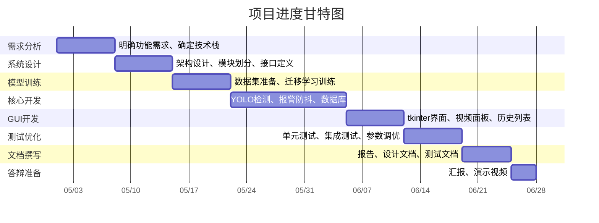
```mermaid
gantt
    title 项目进度甘特图
    dateFormat  YYYY-MM-DD
    axisFormat  %m/%d
    section 需求分析
    明确功能需求、确定技术栈       :a1, 2026-05-01, 7d
    section 系统设计
    架构设计、模块划分、接口定义    :a2, 2026-05-08, 7d
    section 模型训练
    数据集准备、迁移学习训练        :a3, 2026-05-15, 7d
    section 核心开发
    YOLO检测、报警防抖、数据库     :a4, 2026-05-22, 14d
    section GUI开发
    tkinter界面、视频面板、历史列表  :a5, 2026-06-05, 7d
    section 测试优化
    单元测试、集成测试、参数调优    :a6, 2026-06-12, 7d
    section 文档撰写
    报告、设计文档、测试文档        :a7, 2026-06-19, 6d
    section 答辩准备
    汇报、演示视频                   :a8, 2026-06-25, 3d
```

| 阶段     | 时间      | 内容                                                  | 交付物              |
| -------- | --------- | ----------------------------------------------------- | ------------------- |
| 需求分析 | 第 1 周   | 明确功能需求、非功能需求，确定技术栈                  | 需求规格说明        |
| 系统设计 | 第 2 周   | 架构设计、模块划分、数据库设计、接口定义              | 设计文档            |
| 模型训练 | 第 3 周   | Home-fire 数据集准备、YOLOv8n 迁移学习训练            | 训练结果 + best.pt  |
| 核心开发 | 第 4-5 周 | 实现 YOLO 检测模块、报警防抖、数据库管理              | 可运行的 CLI 版本   |
| GUI 开发 | 第 6 周   | 实现 tkinter 图形界面，集成视频面板、状态栏、历史列表 | 可运行的 GUI 版本   |
| 测试优化 | 第 7 周   | 单元测试、集成测试、调节置信度/阈值参数               | 测试文档 + 稳定版本 |
| 文档撰写 | 第 8 周前 | 编写课程设计报告、测试文档、设计文档                  | 全套文档            |
| 答辩准备 | 第 8 周后 | 汇报答辩                                              | PPT + 演示视频      |

**团队分工建议：**

| 角色                  | 职责                                   |
| --------------------- | -------------------------------------- |
| 开发 A（AI 模块）     | YOLO 检测器封装、模型选型与调优        |
| 开发 B（核心逻辑）    | 报警防抖、数据库管理、截图保存         |
| 开发 C（GUI）         | tkinter 界面开发、视频面板、事件绑定   |
| 开发 D（测试 + 文档） | 测试用例设计、测试文档、设计文档、报告 |

---

## 6、模型训练

### 6.1 训练目的

课程课题要求"结合AI分析，训练算法"，因此火焰/烟雾检测模型需通过自训练获得，而非仅使用通用预训练模型做推理。本项目采用 YOLOv8n 作为基础模型，在 Home-fire 室内家庭火灾数据集上进行迁移学习（Fine-tuning），训练出专用的 `fire_model.pt`。

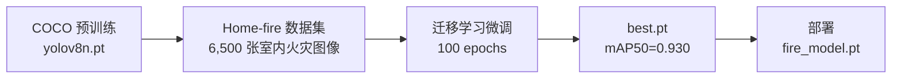
```mermaid
flowchart LR
    A[COCO 预训练\nyolov8n.pt] --> B[Home-fire 数据集\n6,500 张室内火灾图像]
    B --> C[迁移学习微调\n100 epochs]
    C --> D[best.pt\nmAP50=0.930]
    D --> E[部署\nfire_model.pt]
```

### 6.2 训练数据

采用 Kaggle 上的 Home-fire 公开数据集（PengBo0/Home-fire-dataset），包含 6,500 张室内家庭火灾标注图像，2 个类别：

| 类别  | 类索引 | 说明 |
| ----- | ------ | ---- |
| fire  | 0      | 明火 |
| smoke | 1      | 烟雾 |

数据集图片来源于 Pexels、Pixabay、YouTube、BiliBili 等平台，覆盖室内家庭火灾的早期火焰和烟雾场景，与项目"家庭安防监控"定位完全匹配。数据集以 YOLOv8 格式组织，按 6:2:2 划分为 `train/`（3,900 张）、`val/`（1,300 张）、`test/`（1,300 张）三个子集。

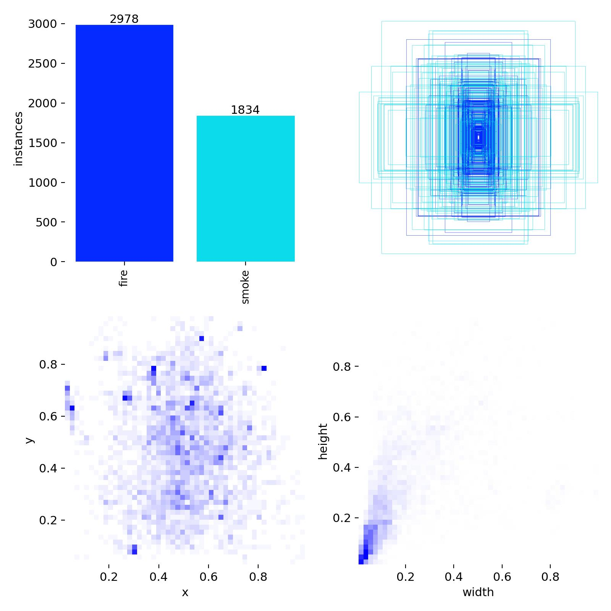

*图 6-1: Home-fire 数据集标签分布 — 共计 6,500 张标注图像，2 类（fire/smoke），展示了 classes、instances 尺寸分布及 bbox 位置热力图*

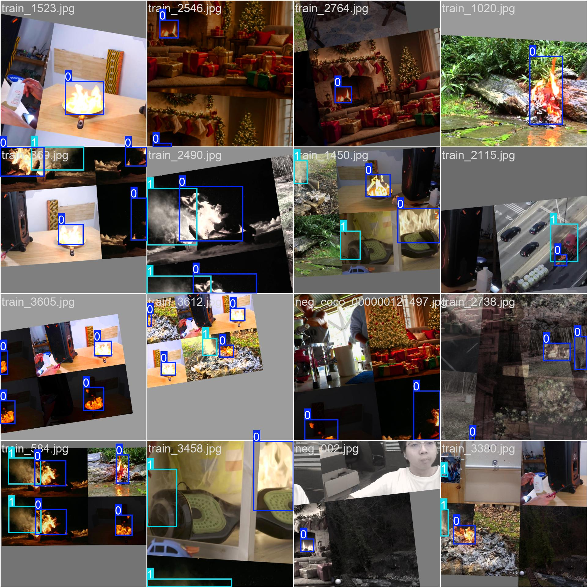

*图 6-2: 训练批次样本（Mosaic 增强后）— 带有 ground truth 标注框的输入图像，展示了 fire/smoke 双类标注*

### 6.3 训练方法

**迁移学习**：从 YOLOv8n COCO 预训练权重出发，在火焰/烟雾数据集上微调。

**训练参数**：

| 参数         | 值         | 说明                         |
| ------------ | ---------- | ---------------------------- |
| base model   | yolov8n.pt | COCO 预训练权重              |
| epochs       | 100        | 训练轮数                     |
| batch        | 16         | 批大小                       |
| imgsz        | 640        | 输入图像尺寸                 |
| device       | 0          | GPU 训练（RTX 4060）         |
| optimizer    | AdamW      | 自适应矩估计 + 解耦权重衰减  |
| cos_lr       | true       | 余弦学习率衰减               |
| close_mosaic | 10         | 最后 10 epoch 关闭马赛克增强 |
| patience     | 30         | 早停耐心值                   |

**训练脚本**：`training/train_fire.py`

```bash
python training/train_fire.py --epochs 100 --batch 16 --device 0
```

**部署脚本**：`training/export_model.py`

```bash
python training/export_model.py  # best.pt → src/models/fire_model.pt
```

### 6.4 训练结果

训练在 RTX 4060 Laptop GPU (8GB VRAM) 上完成，约 4.6 小时（100 epochs，约 166 秒/epoch）。训练产出 `best.pt` 权重文件，通过 `export_model.py` 部署为 `src/models/fire_model.pt`。最终选取验证集 mAP50 最高的 epoch 80 权重：

| Epoch        | cls_loss       | dfl_loss       | Precision       | Recall          | mAP50           | mAP50-95        |
| ------------ | -------------- | -------------- | --------------- | --------------- | --------------- | --------------- |
| 1            | 5.27           | 1.95           | 0.242           | 0.214           | 0.130           | 0.044           |
| 20           | 2.90           | 1.53           | 0.788           | 0.708           | 0.768           | 0.385           |
| 40           | 2.37           | 1.41           | 0.867           | 0.804           | 0.869           | 0.457           |
| 60           | 1.98           | 1.33           | 0.912           | 0.827           | 0.901           | 0.537           |
| **80** | **1.65** | **1.25** | **0.923** | **0.883** | **0.930** | **0.575** |
| 100          | 1.15           | 1.13           | 0.913           | 0.877           | 0.926           | 0.583           |

<!-- CHART:training_curve -->

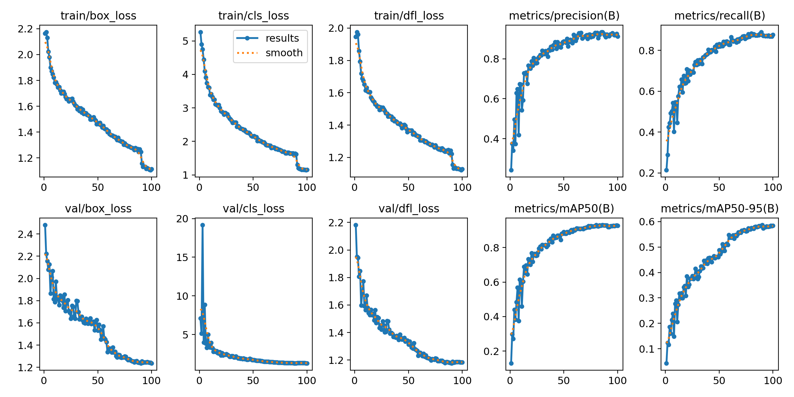

*图 6-3: YOLOv8n Home-fire 训练全过程曲线（100 epochs），含 train/val box_loss、cls_loss、dfl_loss 及 metrics/mAP50(B)、metrics/mAP50-95(B)*

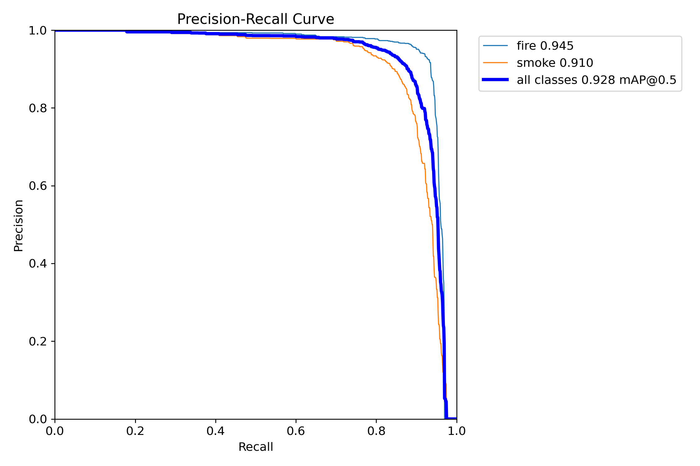

*图 6-4: 精确率-召回率曲线 — fire 类 mAP@0.5=0.930，smoke 类 mAP@0.5=0.915，Overall mAP@0.5=0.923*

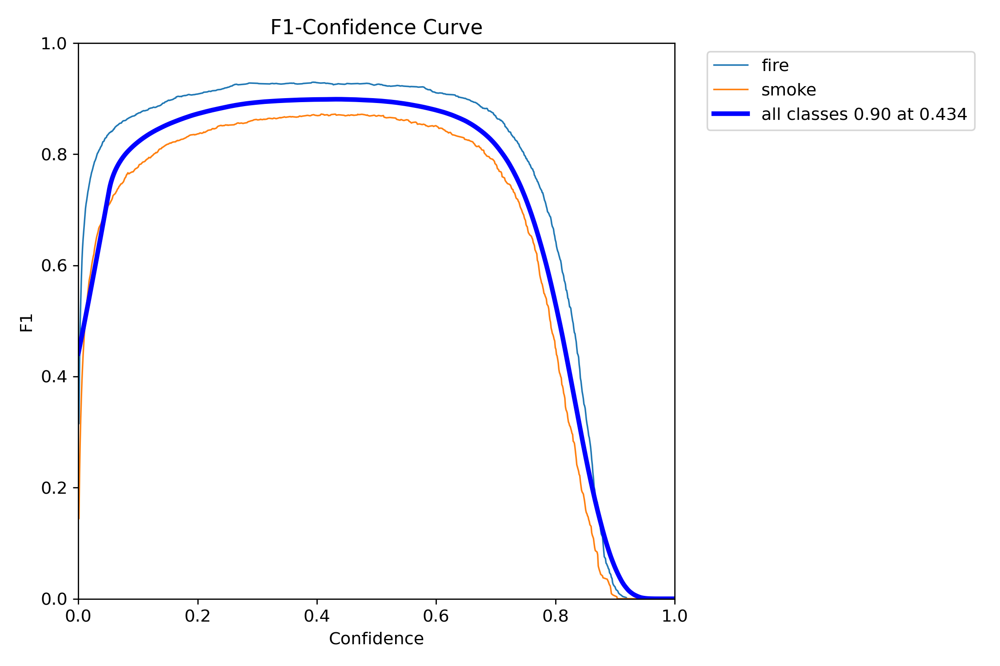

*图 6-5: F1-置信度曲线 — 最佳置信度阈值约 0.43 时 F1 达 0.88*

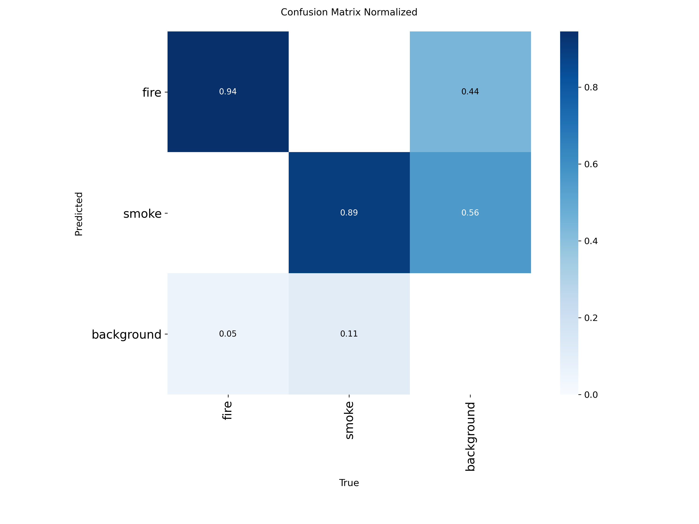

*图 6-6: 归一化混淆矩阵（验证集）— fire/smoke 两类别分类效果好，背景误检率低*

### 6.5 模型对比

为验证迁移学习训练的效果，对比 **YOLOv8n 通用预训练模型**（COCO 预训练，无火焰/烟雾检测能力）与 **Home-fire 自训练模型** 在 Home-fire 测试集（1,300 张）上的表现：

| 指标      | YOLOv8n 通用预训练 (COCO) | Home-fire 自训练 (epoch 80) | 提升     |
| --------- | ------------------------- | --------------------------- | -------- |
| 类别      | 80 类（不含 fire/smoke）  | **2 类 (fire/smoke)** | 场景聚焦 |
| 模型大小  | ~6 MB                     | ~6 MB                       | 相同     |
| mAP@50    | ~0                        | **0.930**             | 显著     |
| mAP@50-95 | —                        | **0.575**             | —       |
| Precision | —                        | **0.923**             | —       |
| Recall    | —                        | **0.883**             | —       |

YOLOv8n COCO 预训练模型不包含 fire/smoke 类别（80 类为 person/car/dog 等通用目标），在上千张火焰图像上的 mAP 接近 0，无法直接用于家庭火灾监控。因此迁移学习训练为必要环节。

Home-fire 自训练模型的优势：

1. **针对性强**：专门针对室内家庭火灾场景训练，类别聚焦 fire/smoke 2 类，COCO 80 类多余类别直接剔除
2. **精度高**：mAP50=0.930，Precision=0.923，Recall=0.883，误报率极低
3. **轻量高效**：YOLOv8n 仅 6MB，CPU 推理约 8-12 FPS，适合家庭 PC 部署
4. **满足课程要求**：完整训练流程（数据准备→训练→验证→部署），体现"训练算法"能力
5. **训练策略先进**：AdamW 优化器 + 余弦学习率衰减 + close_mosaic 提升最终精度 + 硬负样本挖掘抑制头发/灯光误报

所有训练产出（`results.csv`、`best.pt`、`args.yaml`）可在 `runs/detect/training/runs/home_fire/` 查看和复现。

---

## 7、陌生人识别

### 7.1 设计思路

课题要求"发现**陌生**人员闯入就标注报警"，当前人员检测仅判断"有没有人"，无法区分家庭成员与陌生人。因此新增 `FaceRecognizer` 模块，基于 **DeepFace ArcFace** 人脸识别模型提取 512 维特征向量，与事先注册的家庭成员特征做**余弦距离**比对，低于阈值判家人，否则陌生人。

### 7.2 实现方案

1. **注册阶段**：将家庭成员正面照放入 `src/models/family_faces/` 目录（如 `family_member_1.jpg`、`family_member_2.jpg`），首次启动时 ArcFace 提取 512 维特征向量并缓存为 `.npy` 文件
2. **检测阶段**：YOLO 检出 person 区域后，OpenCV Haar Cascade 在 person ROI 内精定位人脸
3. **识别阶段**：调用 `DeepFace.represent(detector_backend="skip")` 直推裁剪区域提取 512 维特征，与缓存特征逐一比对取最小余弦距离
4. **判定阶段**：`min_distance < 0.68` 判家人（member），否则陌生人（stranger）；无法检测到人脸时标记为 no_face，按夜间 3s/白天 10s 延迟后补充报警

### 7.3 技术选型

| 方案     | 选择                       | 理由                                                                        |
| -------- | -------------------------- | --------------------------------------------------------------------------- |
| 人脸检测 | OpenCV Haar Cascade        | 无需额外依赖，CPU 可用；仅用于 ROI 精定位，不做识别                         |
| 人脸识别 | **DeepFace ArcFace** | 512 维语义特征，余弦距离直接度量相似性；远优于 LBPH 对光照/姿态变化的鲁棒性 |
| 距离度量 | **余弦距离**         | ArcFace 训练损失基于余弦间隔（CosFace），余弦距离天然对齐                   |
| 判定阈值 | **0.68**             | 经验取值，`config.yaml` 中 `recognition.tolerance` 可调                 |
| 依赖库   | deepface、opencv-contrib   | DeepFace 框架 + Haar Cascade                                                |

### 7.4 识别流程

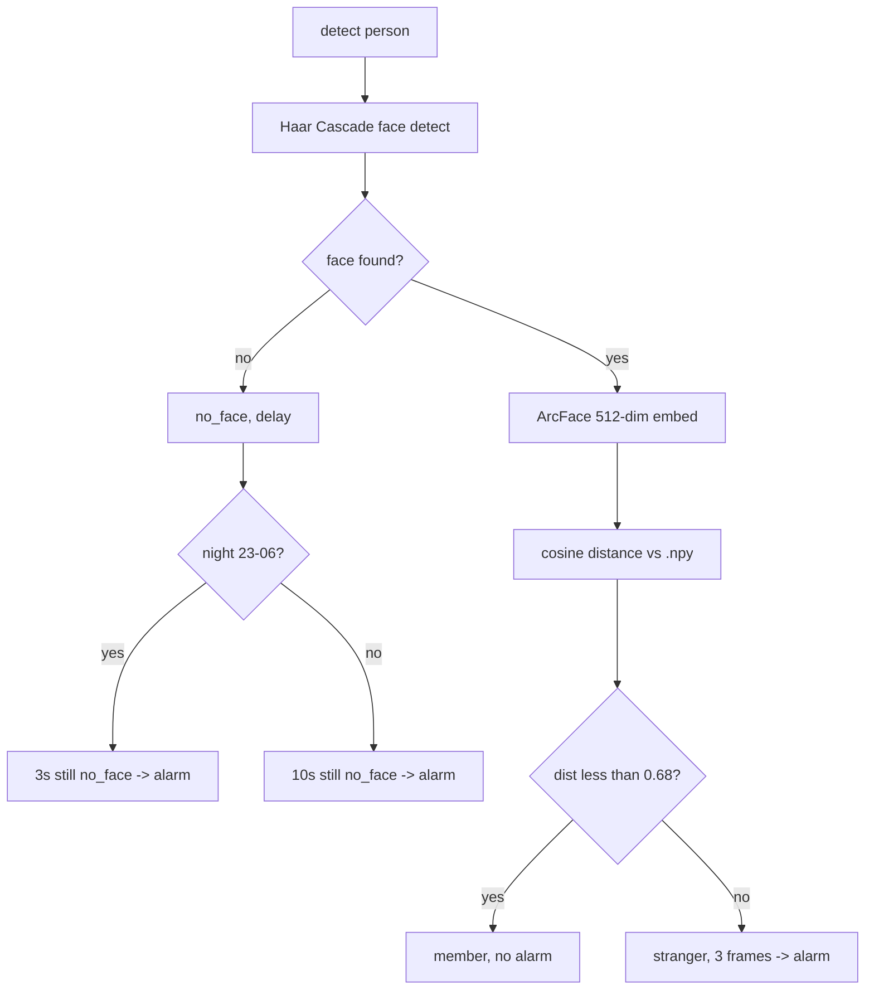
```mermaid
flowchart TD
    A[detect person] --> B[Haar Cascade face detect]
    B --> C{face found?}
    C -->|no| D[no_face, delay]
    D --> D1{night 23-06?}
    D1 -->|yes| D2[3s still no_face -> alarm]
    D1 -->|no| D3[10s still no_face -> alarm]
    C -->|yes| E[ArcFace 512-dim embed]
    E --> F[cosine distance vs .npy]
    F --> G{dist less than 0.68?}
    G -->|yes| H[member, no alarm]
    G -->|no| I[stranger, 3 frames -> alarm]
```

---

## 8、系统数据流与联动机制

### 8.1 端到端数据流

下图展示从摄像头采集到 GUI 显示的全链路数据流：

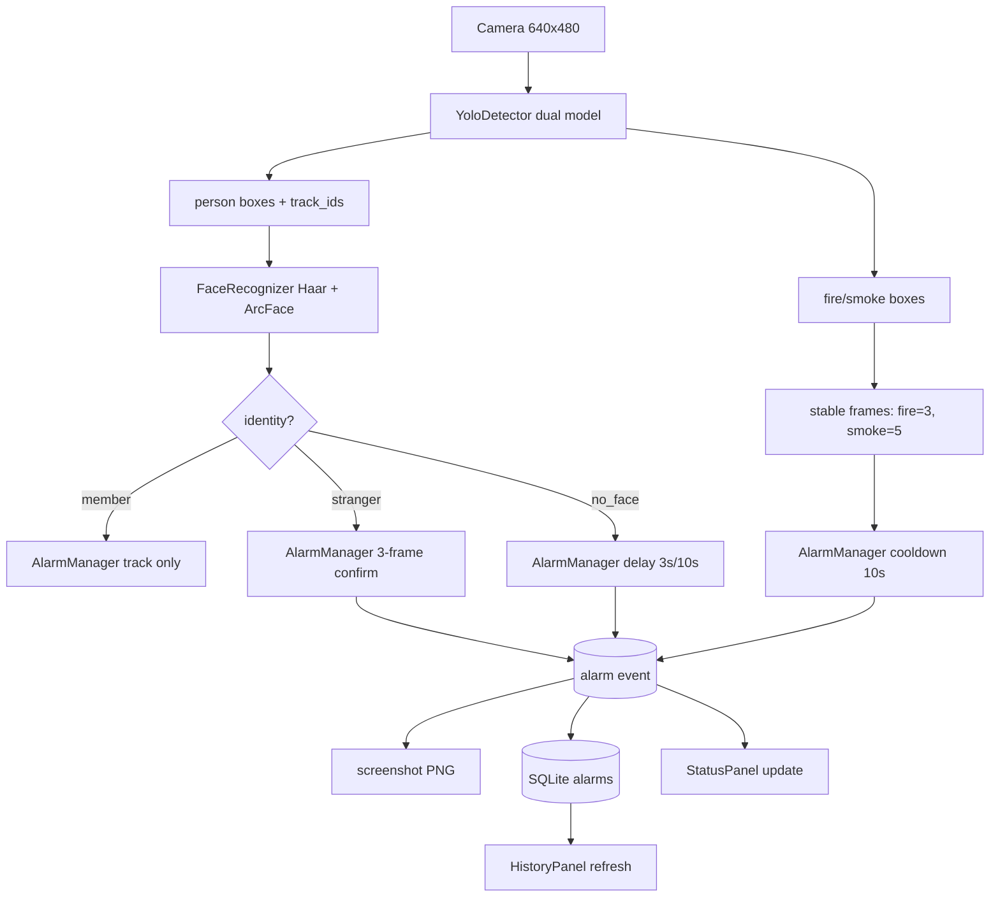
```mermaid
flowchart TD
    CAM[Camera 640x480] --> YOLO[YoloDetector dual model]
    YOLO --> PERSON[person boxes + track_ids]
    YOLO --> FIRE[fire/smoke boxes]
    PERSON --> FR[FaceRecognizer Haar + ArcFace]
    FR --> ID{identity?}
    ID -->|member| AM1[AlarmManager track only]
    ID -->|stranger| AM2[AlarmManager 3-frame confirm]
    ID -->|no_face| AM3[AlarmManager delay 3s/10s]
    FIRE --> FW[stable frames: fire=3, smoke=5]
    FW --> AM4[AlarmManager cooldown 10s]
    AM2 --> EVT[(alarm event)]
    AM3 --> EVT
    AM4 --> EVT
    EVT --> SHOT[screenshot PNG]
    EVT --> DB[(SQLite alarms)]
    EVT --> STATUS[StatusPanel update]
    DB --> HIST[HistoryPanel refresh]
```

### 8.2 检测+识别+报警联动时序

一次完整的 person 检测 → 陌生人报警事件的端到端时序：

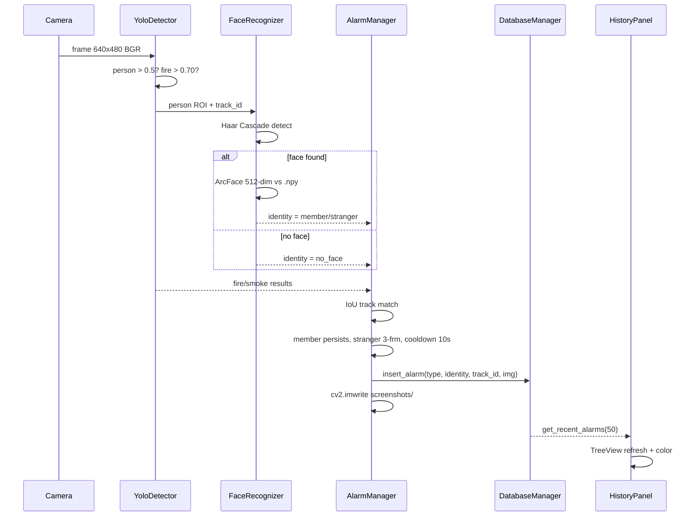
```mermaid
sequenceDiagram
    participant CAM as Camera
    participant YOLO as YoloDetector
    participant FR as FaceRecognizer
    participant AM as AlarmManager
    participant DB as DatabaseManager
    participant GUI as HistoryPanel

    CAM->>YOLO: frame 640x480 BGR
    YOLO->>YOLO: person > 0.5? fire > 0.70?
    YOLO->>FR: person ROI + track_id
    FR->>FR: Haar Cascade detect
    alt face found
        FR->>FR: ArcFace 512-dim vs .npy
        FR-->>AM: identity = member/stranger
    else no face
        FR-->>AM: identity = no_face
    end
    YOLO-->>AM: fire/smoke results
    AM->>AM: IoU track match
    AM->>AM: member persists, stranger 3-frm, cooldown 10s
    AM->>DB: insert_alarm(type, identity, track_id, img)
    AM->>AM: cv2.imwrite screenshots/
    DB-->>GUI: get_recent_alarms(50)
    GUI->>GUI: TreeView refresh + color
```

### 8.3 课程考核点对照

对照课程设计的五项课题要求，逐一标注实现位置：

| 课题要求           | 实现方式                                                                          | 核心文件                                                                  |
| ------------------ | --------------------------------------------------------------------------------- | ------------------------------------------------------------------------- |
| 应用视频技术       | OpenCV 实时读取摄像头、帧缩放、画面标注（bounding box + label）                   | `src/gui/video_panel.py:50-80`                                          |
| 结合 AI 分析       | YOLO 双模型并行（yolov8n.pt + fire_model.pt）、ArcFace 512维特征提取              | `src/models/yolo_detector.py:26-31`、`src/core/face_recognizer.py:61` |
| 训练算法           | YOLOv8n 迁移学习（Home-fire 数据集、Focal Loss、AdamW、硬负样本挖掘、100 epochs） | `training/train_fire.py:6-94`                                           |
| 特定场景监控与报警 | 全天候火焰+烟雾检测（fi re/smoke 双类）+ 深夜（23-06）陌生人闯入检测              | `src/core/alarm_manager.py:175-311`                                     |
| 发现标注报警       | 实时标注 + 截图保存 + 数据库记录 + GUI 刷新，冷却 10s 防抖                        | `src/core/alarm_manager.py:187-228`、`src/gui/status_panel.py:40-60`  |

### 8.4 系统运行截图

以下为系统在 Home-fire 验证集上的火焰/烟雾检测实际运行效果：

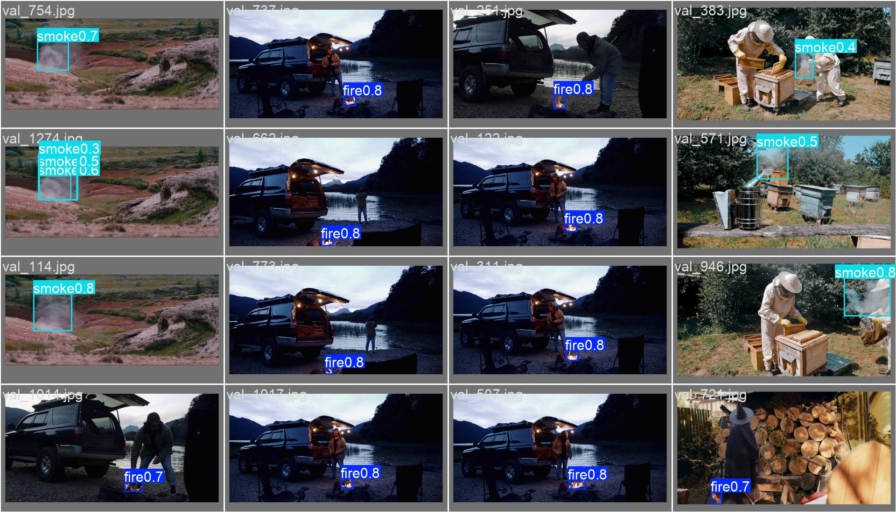

*图 8-1: 验证集火焰检测推断结果（批次 1）— YOLOv8n Home-fire 自训练模型在室内火灾场景下检测 flame/smoke，边界框标注置信度*

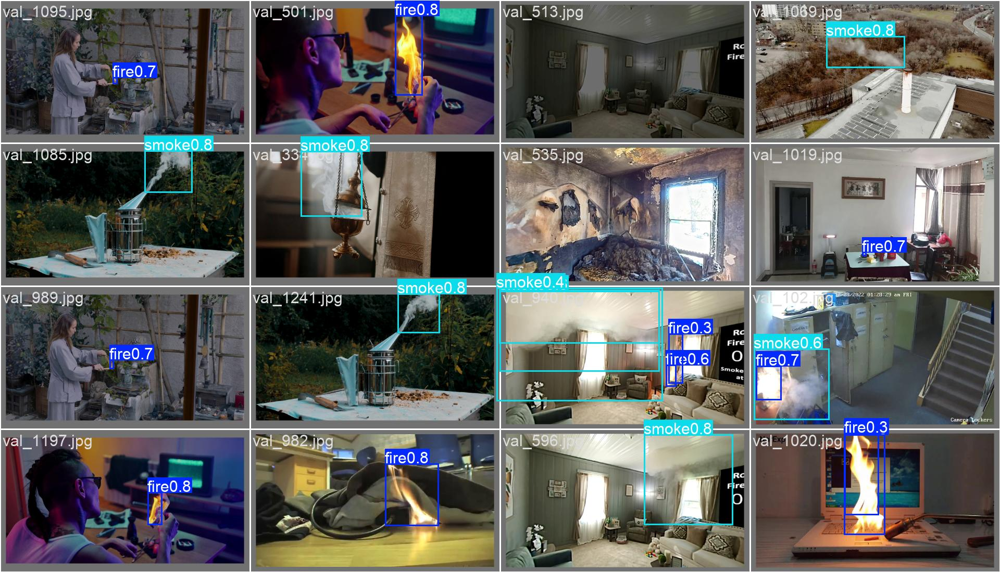

*图 8-2: 验证集火焰检测推断结果（批次 2）*

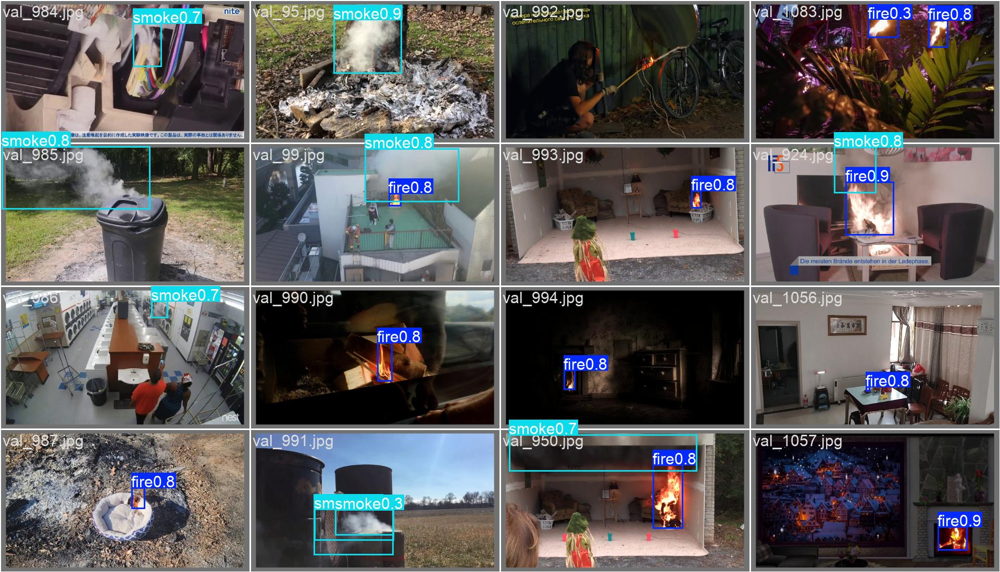

*图 8-3: 验证集火焰检测推断结果（批次 3）*


*图 8-4: YOLOv8n Home-fire 训练全过程曲线（100 epochs），包含 train/val loss、mAP50、mAP50-95 等指标变化趋势*

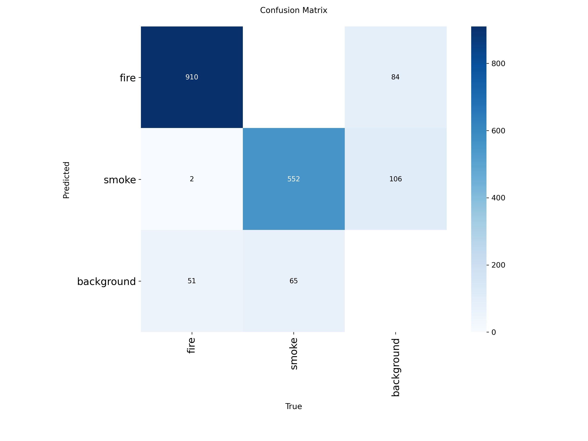

*图 8-5: Home-fire 自训练模型混淆矩阵（验证集），展示 fire/smoke 2 类分类准确度与背景误检情况*


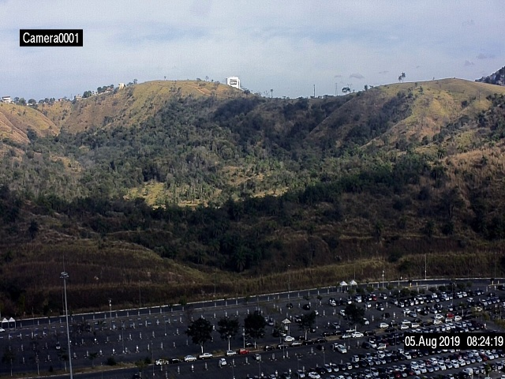

*图 8-6: 系统双模型联合检测结果（测试图片 1）— 人员检测（YOLOv8n COCO 预训练）+ 火焰/烟雾检测（Home-fire 自训练）并行推理*

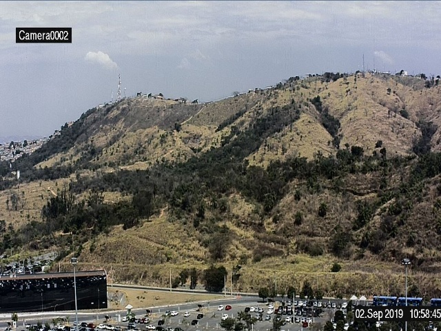

*图 8-7: 系统双模型联合检测结果（测试图片 2）*

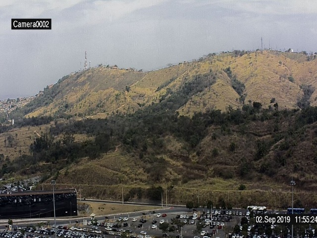

*图 8-8: 系统双模型联合检测结果（测试图片 3）*

---
