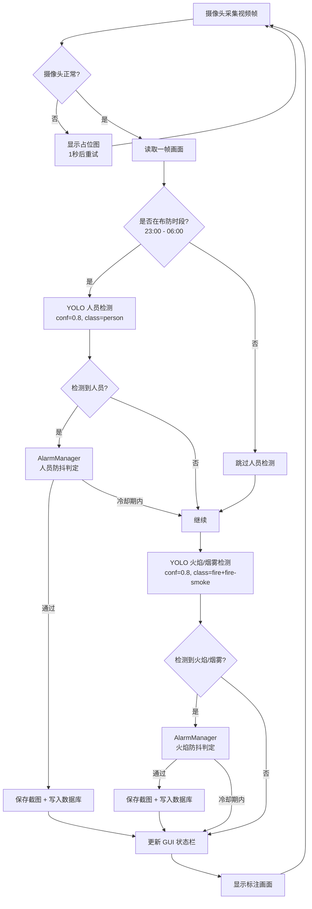
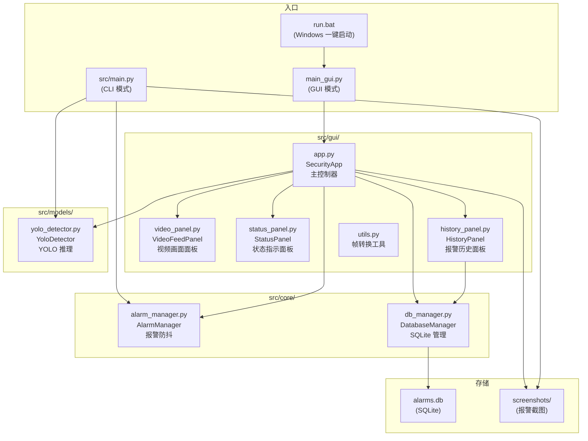
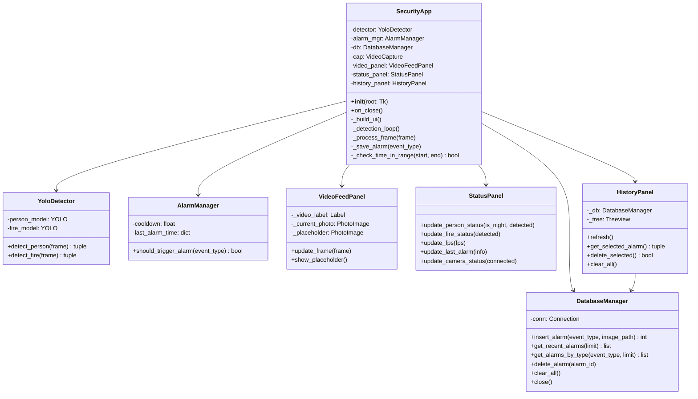
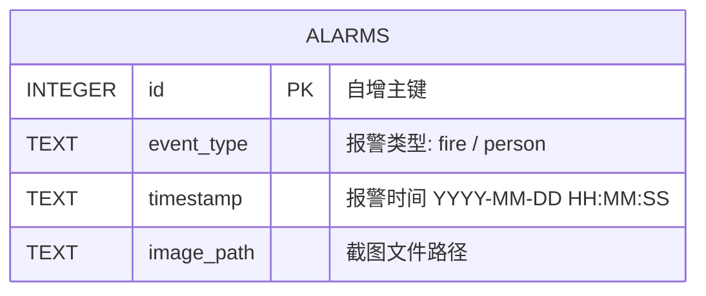

# Home Security Monitor 设计文档

## 1、引言

### 1.1 编写目的

本文档详细描述 Home Security Monitor 系统的架构设计、模块划分、类接口定义及数据库结构，作为开发、维护和后续扩展的技术依据。读者包括开发团队成员、系统维护人员及项目评审方。

### 1.2 概要设计

系统采用**分层模块化架构**，自上而下分为三层：

```
┌──────────────────────────────────────────────┐
│                表现层 (GUI / CLI)              │
│   main_gui.py  /  src/gui/  /  src/main.py   │
├──────────────────────────────────────────────┤
│                业务逻辑层 (Core)               │
│   alarm_manager.py  /  db_manager.py         │
├──────────────────────────────────────────────┤
│                模型层 (Models)                 │
│   yolo_detector.py  /  YOLO 预训练模型        │
└──────────────────────────────────────────────┘
```

- **表现层**：提供 GUI（tkinter）和 CLI（OpenCV imshow）两种交互方式，负责画面渲染、用户操作响应。
- **业务逻辑层**：报警防抖去重（AlarmManager）、数据库读写（DatabaseManager），与具体检测算法解耦。
- **模型层**：封装 YOLO 模型加载与推理，对上层暴露统一接口。

### 1.3 业务流程图



---

## 2、系统总体结构设计

### 2.1 模块划分



### 2.2 部署视图

```
项目根目录/
├── main_gui.py              # GUI 入口
├── run.bat                  # Windows 双击启动
├── src/
│   ├── main.py              # CLI 入口（后备方案）
│   ├── gui/                 # GUI 包
│   │   ├── app.py           #   主控制器 + 检测主循环
│   │   ├── video_panel.py   #   视频面板
│   │   ├── status_panel.py  #   状态栏
│   │   ├── history_panel.py #   历史列表
│   │   └── utils.py         #   帧转换 (cv2 → PIL)
│   ├── core/                # 核心业务逻辑
│   │   ├── alarm_manager.py #   报警防抖
│   │   ├── db_manager.py    #   数据库管理
│   │   └── alarms.db        #   SQLite 数据文件（运行时生成）
│   ├── models/              # AI 模型
│   │   ├── yolo_detector.py #   YOLO 检测器封装
│   │   ├── yolov8n.pt       #   人员检测模型
│   │   └── fire_model.pt    #   火焰检测模型
│   └── screenshots/         # 报警截图（运行时生成）
├── tests/
│   └── test_db.py           # 数据库单元测试
└── docs/
    ├── 测试文档.md
    └── 设计文档.md
```

---

## 3、类图及接口设计

### 3.1 类图



### 3.2 核心接口说明

#### YoloDetector

| 方法 | 参数 | 返回值 | 说明 |
|------|------|--------|------|
| `detect_person` | `frame: ndarray` | `(has_person: bool, annotated_frame: ndarray)` | 人员检测，仅检测 COCO class 0 (person)，置信度 0.8 |
| `detect_fire` | `frame: ndarray` | `(has_fire: bool, annotated_frame: ndarray)` | 火焰检测，仅检测 class 0 (fire-smoke) + class 3 (fire)，置信度 0.8 |

#### AlarmManager

| 方法 | 参数 | 返回值 | 说明 |
|------|------|--------|------|
| `__init__` | `cooldown_seconds: int = 10` | — | 设置报警冷却时间 |
| `should_trigger_alarm` | `event_type: str` ("fire" 或 "person") | `bool` | True=新报警，False=冷却期内抑制 |

两种事件类型（fire / person）的冷却计时器相互独立。

#### DatabaseManager

| 方法 | 参数 | 返回值 | 说明 |
|------|------|--------|------|
| `insert_alarm` | `event_type, image_path` | `int` (row_id) | 插入报警记录 |
| `get_recent_alarms` | `limit=50` | `list[tuple]` | 按 ID 降序查询 |
| `get_alarms_by_type` | `event_type, limit=50` | `list[tuple]` | 按类型筛选 |
| `delete_alarm` | `alarm_id` | — | 删除单条记录 |
| `clear_all` | — | — | 清空全部记录 |

#### GUI 面板

| 面板 | 关键方法 | 说明 |
|------|----------|------|
| `VideoFeedPanel` | `update_frame(frame)`, `show_placeholder()` | 渲染视频帧或占位图 |
| `StatusPanel` | `update_person_status()`, `update_fire_status()`, `update_fps()` | 更新状态指示 |
| `HistoryPanel` | `refresh()`, `delete_selected()`, `clear_all()` | 历史列表管理 |

---

## 4、数据库设计

### 4.1 ER 图



### 4.2 表结构

| 字段 | 类型 | 约束 | 说明 |
|------|------|------|------|
| `id` | INTEGER | PRIMARY KEY AUTOINCREMENT | 自增主键 |
| `event_type` | TEXT | NOT NULL | 报警类型：`fire` 或 `person` |
| `timestamp` | TEXT | NOT NULL | 报警发生时间，格式 `YYYY-MM-DD HH:MM:SS` |
| `image_path` | TEXT | NOT NULL | 截图文件绝对/相对路径 |

### 4.3 建表 SQL

```sql
CREATE TABLE IF NOT EXISTS alarms (
    id         INTEGER PRIMARY KEY AUTOINCREMENT,
    event_type TEXT    NOT NULL,
    timestamp  TEXT    NOT NULL,
    image_path TEXT    NOT NULL
);
```

### 4.4 常用查询

```sql
-- 查看最近 100 条报警
SELECT * FROM alarms ORDER BY id DESC LIMIT 100;

-- 按类型统计
SELECT event_type, COUNT(*) FROM alarms GROUP BY event_type;

-- 按日期筛选
SELECT * FROM alarms WHERE date(timestamp) = '2026-05-20';

-- 删除指定记录
DELETE FROM alarms WHERE id = ?;

-- 清空表
DELETE FROM alarms;
```

### 4.5 设计说明

1. **选择 SQLite 的理由**：嵌入式、零配置、无需安装数据库服务，适合家庭单机部署场景。数据库文件 `alarms.db` 自动生成在 `src/core/` 目录下。
2. **时间戳使用 TEXT 类型**：以可读格式存储，SQLite 内置 `date()` / `datetime()` 函数可直接用于日期筛选。
3. **截图路径**：存储完整路径以适应不同运行环境。截图统一存放在 `src/screenshots/` 目录，文件命名格式 `{event_type}_{YYYYMMDD_HHMMSS}.jpg`。
4. **不使用外键**：当前只有单表，无需关联。未来若扩展多摄像头支持，可增加 `camera_id` 字段。

---

## 5、其他

### 5.1 技术选型

| 层 | 技术 | 选择理由 |
|----|------|----------|
| AI 推理 | YOLOv8n + 火焰检测模型 | 轻量级，CPU 可运行 |
| GUI | tkinter (ttk + clam 主题) | Python 内置，无需安装 |
| 数据库 | SQLite3 | 零配置，适合单机 |
| 图像处理 | OpenCV + Pillow | OpenCV 处理视频，Pillow 桥接 tkinter |
| 平台 | Windows 11 + Python 3.11 | 目标运行环境 |

### 5.2 可扩展性

- **替换 AI 模型**：只需修改 `YoloDetector` 类，上层调用无需改动。
- **增加传感器类型**：在 `AlarmManager` 中新增事件类型 key，不影响现有逻辑。
- **多摄像头支持**：`DatabaseManager` 表结构中新增 `camera_id` 字段即可。
- **远程推送**：在 `SecurityApp._save_alarm()` 中增加通知接口调用，发送邮件或推送。

### 5.3 配置文件

当前所有参数硬编码于源码中，后续可抽取为配置文件：

```
# config.yaml (建议)
monitor:
  person_start: "23:00"
  person_end: "06:00"
alarm:
  cooldown_seconds: 10
detection:
  person_conf: 0.8
  fire_conf: 0.8
  fire_classes: [0, 3]
camera:
  device_id: 0
  width: 640
  height: 480
```
