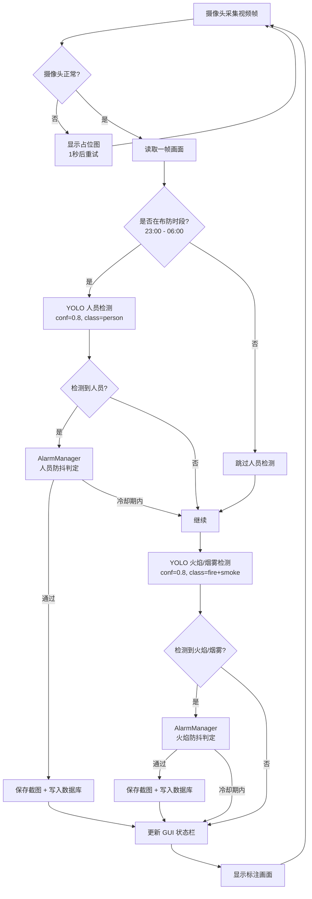
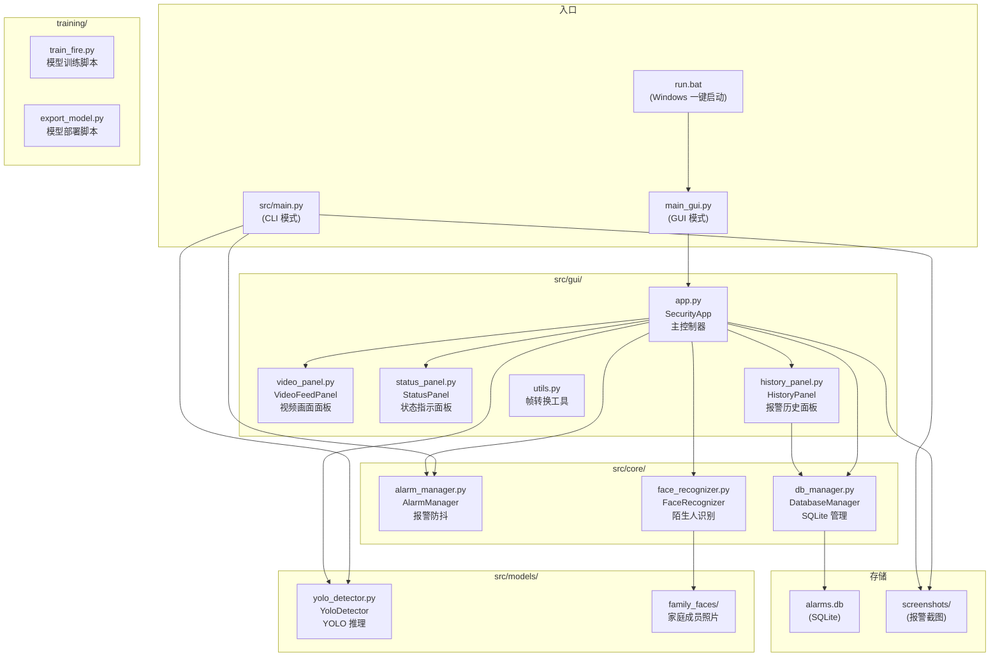
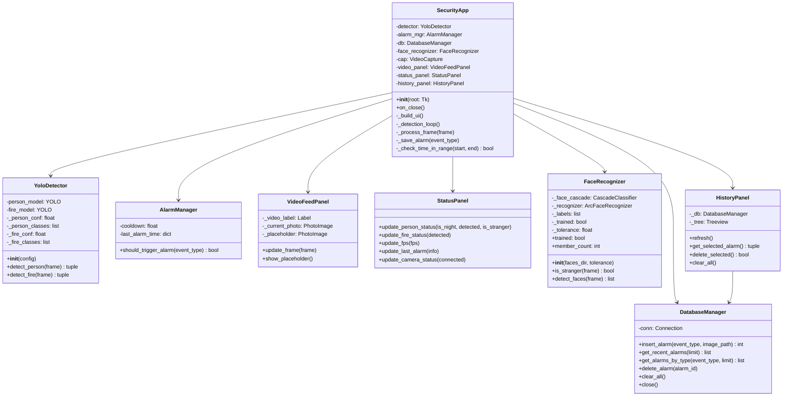
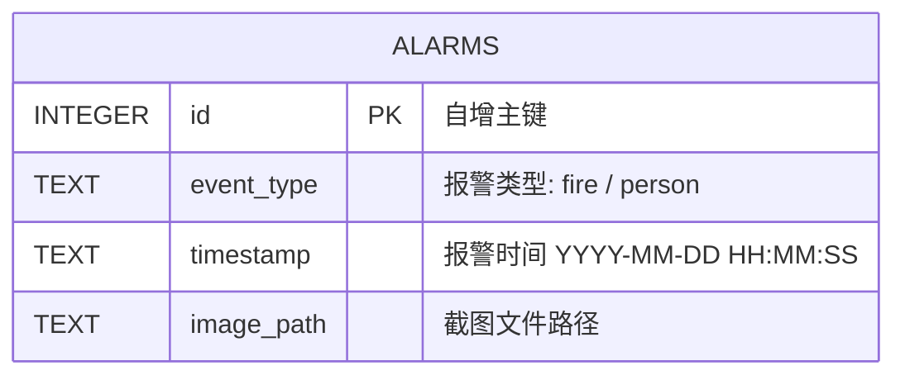
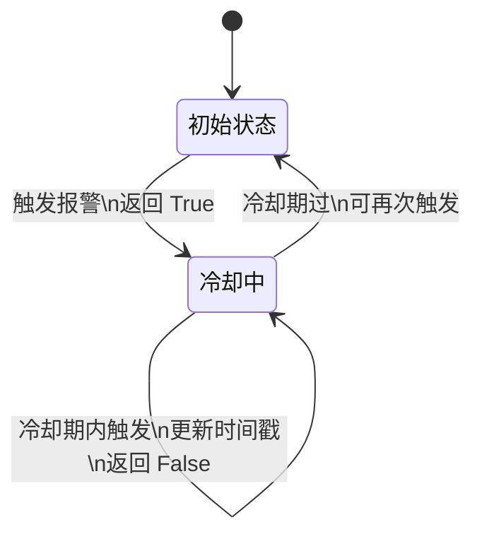
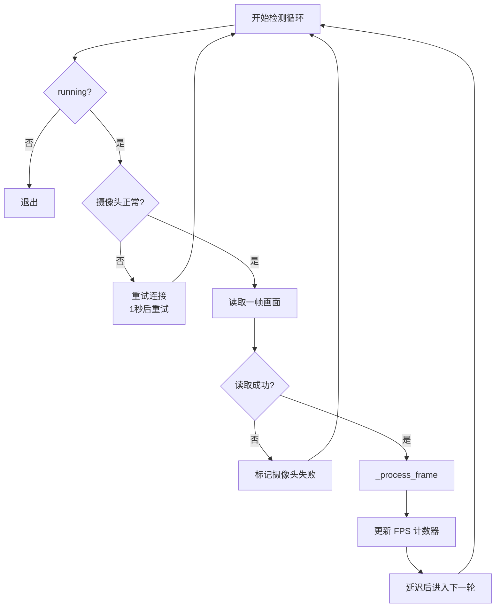
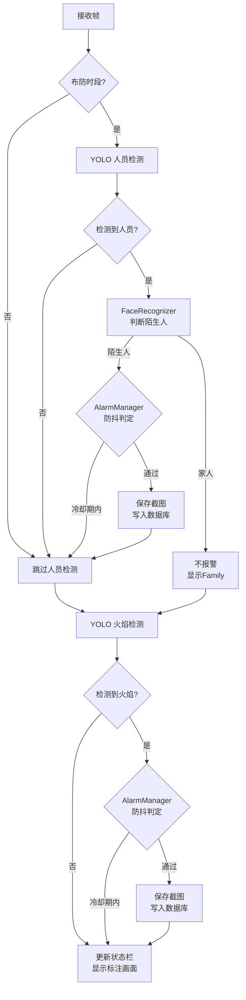

# Home Security Monitor 设计文档

## 1、引言

### 1.1 编写目的

本文档详细描述 Home Security Monitor 系统的架构设计、模块划分、类接口定义及数据库结构，作为开发、维护和后续扩展的技术依据。读者包括开发团队成员、系统维护人员及项目评审方。

### 1.2 概要设计

系统采用**分层模块化架构**，自上而下分为三层：

```
┌──────────────────────────────────────────────┐
│                表现层 (GUI / CLI)              │
│   main_gui.py  /  src/gui/  /  src/main.py   │
├──────────────────────────────────────────────┤
│                业务逻辑层 (Core)               │
│   alarm_manager.py  /  db_manager.py         │
├──────────────────────────────────────────────┤
│                模型层 (Models)                 │
│   yolo_detector.py  /  YOLO 预训练模型        │
└──────────────────────────────────────────────┘
```

- **表现层**：提供 GUI（tkinter）和 CLI（OpenCV imshow）两种交互方式，负责画面渲染、用户操作响应。
- **业务逻辑层**：报警防抖去重（AlarmManager）、数据库读写（DatabaseManager），与具体检测算法解耦。
- **模型层**：封装 YOLO 模型加载与推理，对上层暴露统一接口。

### 1.3 业务流程图


```mermaid
flowchart TD
    A[摄像头采集视频帧] --> B{摄像头正常?}
    B -->|否| C[显示占位图\n1秒后重试]
    C --> A
    B -->|是| D[读取一帧画面]
    D --> E{是否在布防时段?\n23:00 - 06:00}
    E -->|是| F[YOLO 人员检测\nconf=0.8, class=person]
    E -->|否| G[跳过人员检测]
    F --> H{检测到人员?}
    H -->|是| I[AlarmManager\n人员防抖判定]
    H -->|否| J[继续]
    I -->|通过| K[保存截图 + 写入数据库]
    I -->|冷却期内| J
    G --> J
    J --> L[YOLO 火焰/烟雾检测\nconf=0.8, class=fire+smoke]
    L --> M{检测到火焰/烟雾?}
    M -->|是| N[AlarmManager\n火焰防抖判定]
    M -->|否| O[更新 GUI 状态栏]
    N -->|通过| P[保存截图 + 写入数据库]
    N -->|冷却期内| O
    K --> O
    P --> O
    O --> Q[显示标注画面]
    Q --> A
```

---

## 2、系统总体结构设计

### 2.1 模块划分


```mermaid
graph TB
    subgraph Entry["入口"]
        CLI["src/main.py\n(CLI 模式)"]
        GUI_ENTRY["main_gui.py\n(GUI 模式)"]
        BAT["run.bat\n(Windows 一键启动)"]
    end

    subgraph GUI["src/gui/"]
        APP["app.py\nSecurityApp\n主控制器"]
        VIDEO["video_panel.py\nVideoFeedPanel\n视频画面面板"]
        STATUS["status_panel.py\nStatusPanel\n状态指示面板"]
        HISTORY["history_panel.py\nHistoryPanel\n报警历史面板"]
        UTILS["utils.py\n帧转换工具"]
    end

    subgraph Core["src/core/"]
        ALARM["alarm_manager.py\nAlarmManager\n报警防抖"]
        DB["db_manager.py\nDatabaseManager\nSQLite 管理"]
        FACE["face_recognizer.py\nFaceRecognizer\n陌生人识别"]
    end

    subgraph Models["src/models/"]
        YOLO["yolo_detector.py\nYoloDetector\nYOLO 推理"]
        FACES["family_faces/\n家庭成员照片"]
    end

    subgraph Training["training/"]
        TRAIN["train_fire.py\n模型训练脚本"]
        EXPORT["export_model.py\n模型部署脚本"]
    end

    subgraph Storage["存储"]
        DB_FILE["alarms.db\n(SQLite)"]
        IMG["screenshots/\n(报警截图)"]
    end

    BAT --> GUI_ENTRY
    GUI_ENTRY --> APP
    CLI --> YOLO
    CLI --> ALARM
    APP --> VIDEO
    APP --> STATUS
    APP --> HISTORY
    APP --> YOLO
    APP --> ALARM
    APP --> DB
    APP --> FACE
    FACE --> FACES
    HISTORY --> DB
    DB --> DB_FILE
    APP --> IMG
    CLI --> IMG
```

### 2.2 部署视图

```
项目根目录/
├── main_gui.py              # GUI 入口
├── run.bat                  # Windows 双击启动
├── src/
│   ├── main.py              # CLI 入口（后备方案）
│   ├── gui/                 # GUI 包
│   │   ├── app.py           #   主控制器 + 检测主循环
│   │   ├── video_panel.py   #   视频面板
│   │   ├── status_panel.py  #   状态栏
│   │   ├── history_panel.py #   历史列表
│   │   └── utils.py         #   帧转换 (cv2 → PIL)
│   ├── core/                # 核心业务逻辑
│   │   ├── alarm_manager.py #   报警防抖
│   │   ├── db_manager.py    #   数据库管理
│   │   ├── face_recognizer.py # 陌生人识别
│   │   ├── config.py        #   配置读取
│   │   ├── logger.py        #   日志初始化
│   │   └── alarms.db        #   SQLite 数据文件（运行时生成）
│   ├── models/              # AI 模型
│   │   ├── yolo_detector.py #   YOLO 检测器封装
│   │   ├── fire_model.pt    #   自训练火焰检测模型
│   │   └── family_faces/    #   家庭成员照片目录
│   └── screenshots/         # 报警截图（运行时生成）
├── training/                # 模型训练
│   ├── train_fire.py        #   火焰模型训练脚本
│   ├── export_model.py      #   模型部署脚本
│   ├── README.md            #   训练文档
│   └── data/                #   训练数据集（不提交到 Git）
│   └── runs/                #   训练产出（不提交到 Git）
├── config.yaml              # 配置文件
├── tests/
│   └── test_db.py           # 数据库单元测试
└── docs/
    ├── 测试文档.md
    └── 设计文档.md
```

---

## 3、类图及接口设计

### 3.1 类图


```mermaid
classDiagram
    class SecurityApp {
        -detector: YoloDetector
        -alarm_mgr: AlarmManager
        -db: DatabaseManager
        -face_recognizer: FaceRecognizer
        -cap: VideoCapture
        -video_panel: VideoFeedPanel
        -status_panel: StatusPanel
        -history_panel: HistoryPanel
        +__init__(root: Tk)
        +on_close()
        -_build_ui()
        -_detection_loop()
        -_process_frame(frame)
        -_save_alarm(event_type)
        -_check_time_in_range(start, end) bool
    }

    class YoloDetector {
        -person_model: YOLO
        -fire_model: YOLO
        -_person_conf: float
        -_person_classes: list
        -_fire_conf: float
        -_fire_classes: list
        +__init__(config)
        +detect_person(frame) tuple
        +detect_fire(frame) tuple
    }

    class AlarmManager {
        -cooldown: float
        -last_alarm_time: dict
        +should_trigger_alarm(event_type) bool
    }

    class DatabaseManager {
        -conn: Connection
        +insert_alarm(event_type, image_path) int
        +get_recent_alarms(limit) list
        +get_alarms_by_type(event_type, limit) list
        +delete_alarm(alarm_id)
        +clear_all()
        +close()
    }

    class VideoFeedPanel {
        -_video_label: Label
        -_current_photo: PhotoImage
        -_placeholder: PhotoImage
        +update_frame(frame)
        +show_placeholder()
    }

    class StatusPanel {
        +update_person_status(is_night, detected, is_stranger)
        +update_fire_status(detected)
        +update_fps(fps)
        +update_last_alarm(info)
        +update_camera_status(connected)
    }

    class FaceRecognizer {
        -_face_cascade: CascadeClassifier
        -_recognizer: ArcFaceRecognizer
        -_labels: list
        -_trained: bool
        -_tolerance: float
        +__init__(faces_dir, tolerance)
        +is_stranger(frame) bool
        +detect_faces(frame) list
        +trained: bool
        +member_count: int
    }

    class HistoryPanel {
        -_db: DatabaseManager
        -_tree: Treeview
        +refresh()
        +get_selected_alarm() tuple
        +delete_selected() bool
        +clear_all()
    }

    SecurityApp --> YoloDetector
    SecurityApp --> AlarmManager
    SecurityApp --> DatabaseManager
    SecurityApp --> FaceRecognizer
    SecurityApp --> VideoFeedPanel
    SecurityApp --> StatusPanel
    SecurityApp --> HistoryPanel
    HistoryPanel --> DatabaseManager
```

### 3.2 核心接口说明

#### YoloDetector

| 方法 | 参数 | 返回值 | 说明 |
|------|------|--------|------|
| `__init__` | `config: dict` | — | 从配置加载模型路径和检测参数 |
| `detect_person` | `frame: ndarray` | `(has_person: bool, annotated_frame: ndarray)` | 人员检测，仅检测 COCO class 0 (person)，置信度和类别从配置读取 |
| `detect_fire` | `frame: ndarray` | `(has_fire: bool, annotated_frame: ndarray)` | 火焰检测，自训练模型类别 [0=fire, 1=smoke]，置信度和类别从配置读取 |

#### AlarmManager

| 方法 | 参数 | 返回值 | 说明 |
|------|------|--------|------|
| `__init__` | `cooldown_seconds: int = 10` | — | 设置报警冷却时间 |
| `should_trigger_alarm` | `event_type: str` ("fire" 或 "person") | `bool` | True=新报警，False=冷却期内抑制 |

两种事件类型（fire / person）的冷却计时器相互独立。

#### FaceRecognizer

| 方法 | 参数 | 返回值 | 说明 |
|------|------|--------|------|
| `__init__` | `faces_dir: str, tolerance: float = 0.68` | — | 加载家庭成员照片并训练 ArcFace 识别器 |
| `is_stranger` | `frame: ndarray` | `bool` | True=陌生人（应报警），False=家庭成员或无人脸 |
| `detect_faces` | `frame: ndarray` | `list[tuple]` | 返回人脸位置列表 [(x, y, w, h), ...] |
| `trained` | — | `bool` | 是否已注册家庭成员 |
| `member_count` | — | `int` | 已注册家庭成员数量 |

#### DatabaseManager

| 方法 | 参数 | 返回值 | 说明 |
|------|------|--------|------|
| `insert_alarm` | `event_type, image_path` | `int` (row_id) | 插入报警记录 |
| `get_recent_alarms` | `limit=50` | `list[tuple]` | 按 ID 降序查询 |
| `get_alarms_by_type` | `event_type, limit=50` | `list[tuple]` | 按类型筛选 |
| `delete_alarm` | `alarm_id` | — | 删除单条记录 |
| `clear_all` | — | — | 清空全部记录 |

#### GUI 面板

| 面板 | 关键方法 | 说明 |
|------|----------|------|
| `VideoFeedPanel` | `update_frame(frame)`, `show_placeholder()` | 渲染视频帧或占位图 |
| `StatusPanel` | `update_person_status(is_night, detected, is_stranger)`, `update_fire_status()`, `update_fps()` | 更新状态指示，含家人/陌生人状态 |
| `HistoryPanel` | `refresh()`, `delete_selected()`, `clear_all()` | 历史列表管理 |

---

## 4、数据库设计

### 4.1 ER 图


```mermaid
erDiagram
    ALARMS {
        INTEGER id PK "自增主键"
        TEXT event_type "报警类型: fire / person"
        TEXT timestamp "报警时间 YYYY-MM-DD HH:MM:SS"
        TEXT image_path "截图文件路径"
    }
```

### 4.2 表结构

| 字段 | 类型 | 约束 | 说明 |
|------|------|------|------|
| `id` | INTEGER | PRIMARY KEY AUTOINCREMENT | 自增主键 |
| `event_type` | TEXT | NOT NULL | 报警类型：`fire` 或 `person` |
| `timestamp` | TEXT | NOT NULL | 报警发生时间，格式 `YYYY-MM-DD HH:MM:SS` |
| `image_path` | TEXT | NOT NULL | 截图文件绝对/相对路径 |

### 4.3 建表 SQL

```sql
CREATE TABLE IF NOT EXISTS alarms (
    id         INTEGER PRIMARY KEY AUTOINCREMENT,
    event_type TEXT    NOT NULL,
    timestamp  TEXT    NOT NULL,
    image_path TEXT    NOT NULL
);
```

### 4.4 常用查询

```sql
-- 查看最近 100 条报警
SELECT * FROM alarms ORDER BY id DESC LIMIT 100;

-- 按类型统计
SELECT event_type, COUNT(*) FROM alarms GROUP BY event_type;

-- 按日期筛选
SELECT * FROM alarms WHERE date(timestamp) = '2026-05-20';

-- 删除指定记录
DELETE FROM alarms WHERE id = ?;

-- 清空表
DELETE FROM alarms;
```

### 4.5 设计说明

1. **选择 SQLite 的理由**：嵌入式、零配置、无需安装数据库服务，适合家庭单机部署场景。数据库文件 `alarms.db` 自动生成在 `src/core/` 目录下。
2. **时间戳使用 TEXT 类型**：以可读格式存储，SQLite 内置 `date()` / `datetime()` 函数可直接用于日期筛选。
3. **截图路径**：存储完整路径以适应不同运行环境。截图统一存放在 `src/screenshots/` 目录，文件命名格式 `{event_type}_{YYYYMMDD_HHMMSS}.jpg`。
4. **不使用外键**：当前只有单表，无需关联。未来若扩展多摄像头支持，可增加 `camera_id` 字段。

---

## 4.6、详细设计

### 4.6.1 AlarmManager 防抖算法

**状态定义**：`last_alarm_time: Dict[str, float]`，键为事件类型（"fire"/"person"），值为上次触发时间戳（Unix epoch 秒）。

**算法伪代码**：

```
FUNCTION should_trigger_alarm(event_type):
    current_time = time.time()
    time_since_last = current_time - last_alarm_time[event_type]

    IF time_since_last > cooldown:
        last_alarm_time[event_type] = current_time
        RETURN True      // 新事件，允许报警
    ELSE:
        RETURN False     // 冷却期内，抑制重复，不重置计时器
```

**状态转换图**：


```mermaid
stateDiagram-v2
    [*] --> 初始状态
    初始状态 --> 冷却中 : 触发报警\n返回 True
    冷却中 --> 冷却中 : 冷却期内触发\n更新时间戳\n返回 False
    冷却中 --> 初始状态 : 冷却期过\n可再次触发
```

**关键不变式**：`last_alarm_time[event_type]` 始终等于最近一次调用 `should_trigger_alarm(event_type)` 的时间戳，无论返回 True 还是 False。

### 4.6.2 YoloDetector 检测流程

**detect_person 伪代码**：

```
FUNCTION detect_person(frame):
    results = person_model(frame, conf=0.8, classes=[0])
    has_person = False
    annotated_frame = frame.copy()
    FOR result IN results:
        IF len(result.boxes) > 0:
            has_person = True
        annotated_frame = result.plot()
    RETURN (has_person, annotated_frame)
```

**detect_fire 伪代码**：

```
FUNCTION detect_fire(frame):
    results = fire_model(frame, conf=0.8, classes=[0, 1])
    has_fire = False
    annotated_frame = frame.copy()
    FOR result IN results:
        IF len(result.boxes) > 0:
            has_fire = True
            annotated_frame = result.plot()
    RETURN (has_fire, annotated_frame)
```

**类别映射**：
- 人员模型：class 0 = person（COCO 数据集）
- 火焰模型：class 0 = fire, class 1 = smoke（自训练模型，Home-fire数据集）

### 4.6.3 DatabaseManager CRUD 操作

**insert_alarm 流程**：
1. 获取当前时间戳 `datetime.now().strftime("%Y-%m-%d %H:%M:%S")`
2. 执行 `INSERT INTO alarms (event_type, timestamp, image_path) VALUES (?, ?, ?)`
3. `commit()` 提交事务
4. 返回 `cursor.lastrowid`
5. 异常：捕获 `sqlite3.Error`，记录日志，返回 None

**get_recent_alarms 流程**：
1. 执行 `SELECT id, event_type, timestamp, image_path FROM alarms ORDER BY id DESC LIMIT ?`
2. 返回 `cursor.fetchall()`
3. 异常：捕获 `sqlite3.Error`，返回空列表

**delete_alarm 流程**：
1. 执行 `DELETE FROM alarms WHERE id = ?`
2. `commit()` 提交事务
3. 异常：捕获 `sqlite3.Error`，返回 False

### 4.6.4 SecurityApp 检测主循环

**_detection_loop 流程图**：


```mermaid
flowchart TD
    A[开始检测循环] --> B{running?}
    B -->|否| Z[退出]
    B -->|是| C{摄像头正常?}
    C -->|否| D[重试连接\n1秒后重试]
    D --> A
    C -->|是| E[读取一帧画面]
    E --> F{读取成功?}
    F -->|否| G[标记摄像头失败]
    G --> A
    F -->|是| H[_process_frame]
    H --> I[更新 FPS 计数器]
    I --> J[延迟后进入下一轮]
    J --> A
```

**_process_frame 流程图**：


```mermaid
flowchart TD
    A[接收帧] --> B{布防时段?}
    B -->|是| C[YOLO 人员检测]
    B -->|否| D[跳过人员检测]
    C --> E{检测到人员?}
    E -->|是| F[FaceRecognizer\n判断陌生人]
    E -->|否| D
    F -->|陌生人| G{AlarmManager\n防抖判定}
    F -->|家人| H[不报警\n显示Family]
    G -->|通过| I[保存截图\n写入数据库]
    G -->|冷却期内| D
    I --> D
    D --> J[YOLO 火焰检测]
    H --> J
    J --> K{检测到火焰?}
    K -->|是| L{AlarmManager\n防抖判定}
    K -->|否| M[更新状态栏\n显示标注画面]
    L -->|通过| N[保存截图\n写入数据库]
    L -->|冷却期内| M
    N --> M
```

**_save_alarm 流程**：

```
FUNCTION _save_alarm(event_type):
    timestamp = datetime.now()
    filename = "{event_type}_{timestamp}.jpg"
    filepath = screenshot_dir / filename
    cv2.imwrite(filepath, current_raw_frame)
    db.insert_alarm(event_type, filepath)
    log alarm event
    status_panel.update_last_alarm(...)
    history_panel.refresh()
```

### 4.6.5 配置文件结构

系统参数通过 `config.yaml` 管理，由 `ConfigReader` 加载，支持默认值回退：

```yaml
monitor:
  person_start: "00:00"    # 人员检测开始时段
  person_end: "23:59"      # 人员检测结束时段
alarm:
  cooldown_seconds: 10     # 报警冷却时间
detection:
  person_conf: 0.8         # 人员检测置信度
  person_classes: [0]       # 人员检测类别
  fire_conf: 0.8           # 火焰检测置信度
  fire_classes: [0, 1]      # 火焰检测类别（自训练: 0=fire, 1=smoke）
  fire_model_path: ""       # 火焰模型路径，空则使用默认
camera:
  device_id: 0             # 摄像头设备ID
  width: 640
  height: 480
recognition:
  faces_dir: "src/models/family_faces"  # 家庭成员照片目录
  tolerance: 0.68                       # ArcFace 余弦距离阈值
logging:
  level: "INFO"
  file: "security_monitor.log"
```

### 4.6.6 日志系统

使用 Python `logging` 模块，通过 `setup_logging()` 初始化：
- 控制台输出：所有级别日志
- 文件输出：写入 `security_monitor.log`，UTF-8 编码
- 格式：`%(asctime)s [%(levelname)s] %(name)s: %(message)s`
- 各模块通过 `logging.getLogger(__name__)` 获取独立 logger

---

## 5、其他

### 5.1 技术选型

| 层 | 技术 | 选择理由 |
|----|------|----------|
| AI 推理 | YOLOv8n + 自训练火焰/烟雾模型 | 轻量级，CPU 可运行，mAP50=0.930 |
| GUI | tkinter (ttk + clam 主题) | Python 内置，无需安装 |
| 数据库 | SQLite3 | 零配置，适合单机 |
| 图像处理 | OpenCV + Pillow | OpenCV 处理视频，Pillow 桥接 tkinter |
| 平台 | Windows 11 + Python 3.11 | 目标运行环境 |

### 5.2 可扩展性

- **替换 AI 模型**：只需修改 `YoloDetector` 类，上层调用无需改动。
- **增加传感器类型**：在 `AlarmManager` 中新增事件类型 key，不影响现有逻辑。
- **多摄像头支持**：`DatabaseManager` 表结构中新增 `camera_id` 字段即可。
- **远程推送**：在 `SecurityApp._save_alarm()` 中增加通知接口调用，发送邮件或推送。

### 5.3 配置文件

当前所有参数硬编码于源码中，后续可抽取为配置文件：

```
# config.yaml (建议)
monitor:
  person_start: "23:00"
  person_end: "06:00"
alarm:
  cooldown_seconds: 10
detection:
  person_conf: 0.8
  fire_conf: 0.8
  fire_classes: [0, 1]      # 自训练模型: 0=fire, 1=smoke
camera:
  device_id: 0
  width: 640
  height: 480
```

### 5.4 训练数据选择分析

为验证迁移学习训练的效果，对比 YOLOv8n 通用预训练模型与 Home-fire 自训练模型：

| 指标 | YOLOv8n 通用预训练 (COCO) | Home-fire 自训练 (epoch 80) |
|------|--------------------------|---------------------------|
| 类别 | 80类（不含fire/smoke） | **2类 (fire/smoke)** |
| 模型大小 | ~6 MB | ~6 MB |
| mAP@50 | ~0（无相关类别） | **0.930** |
| mAP@50-95 | — | **0.575** |
| Precision | — | **0.923** |
| Recall | — | **0.883** |

YOLOv8n COCO 预训练模型不包含 fire/smoke 类别，需迁移学习训练。Home-fire 自训练模型专门针对室内家庭火灾场景，100 epochs 训练后达 mAP50=0.930。
